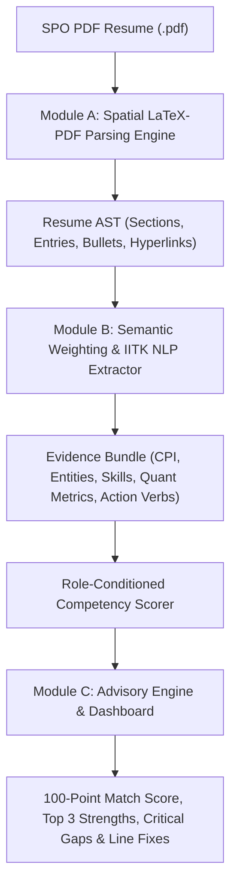

# IIT Kanpur Context-Aware Resume Diagnostic Engine 🎓

> **Academics and Career Council | Career Development Wing (CDW)**  
> **Anweshan '26 Problem Statement — 150 Points Edition**

---

## 📌 Executive Overview

Every placement season at IIT Kanpur, students invest immense effort into compressing years of rigorous academics, complex technical projects, and extracurricular leadership into single-page Student Placement Office (SPO) LaTeX templates. Standard automated parsing tools often scramble multi-column layouts, miss campus-specific contexts (e.g. SURGE, CPI, PoRs), and provide generic advice.

The **IITK Context-Aware Resume Diagnostic Engine** is an intelligent, automated career advisor designed exclusively for candidate upliftment. The engine takes an SPO-formatted PDF resume and target industry track, parses spatial text top-to-bottom and left-to-right, semantically evaluates evidence against role expectations, and generates hyper-specific, grounded counterfactual gap analysis.

---

## 🏛️ System Architecture & Technical Modules



### Module A: The Spatial LaTeX-PDF Parsing Engine (`resume_engine/parser/`)
- **PyMuPDF Extraction**: Extracts spatial text blocks, bounding boxes, and PDF annotation links without scrambling two-column LaTeX grids.
- **Horizontal Gap-Aware Table Stitching**: Uses `_stitch_table_rows(max_gap=30.0)` to merge horizontally-aligned cells (such as education tables) while strictly preserving separation between independent left and right column sections.
- **Bullet & Link Normalization**: Detects bullet variants (`•`, `·`, `-`, `*`, `▪`) and classifies hyperlinks into `github`, `linkedin`, `codeforces`, `leetcode`, and `portfolio`.

### Module B: The Semantic Weighting & NLP Engine (`resume_engine/evidence/`)
- **IITK Jargon Recognition**: Dictionary and regex entity matching for campus bodies (`AnC Council`, `Gymkhana`, `SURGE`, `Techkriti`, `Antaragni`, `Programming Club`, `Takneek`).
- **Academic Metrics Extraction**: Parses CPI/CGPA, Class XII/X percentages, JEE Advanced AIR, KVPY, and Olympiad ranks.
- **Impact & Action Verb Evaluator**: Identifies weak action verbs (`worked on`, `assisted in`, `helped`) and verifies quantifiable impact metrics (e.g. `20% speedup`, `INR 75L+ grant`, `9500+ students`).

### Module C: Advisory Dashboard & REST API (`resume_engine/api/` & `advisory/`)
- **Single-Page Application**: Premium slate dark mode interface built with Tailwind CSS, FontAwesome, and Chart.js.
- **Counterfactual Guidance**: Calculates potential score gain estimates (`+X.X pts`) for addressing critical gap areas.
- **Line-by-Line Formatting Fixes**: Pinpoints specific bullet IDs, page numbers, word count violations (>38 words), and domain-aware verb rewrite suggestions.

---

## 🎯 Role-Specific Baselines

The engine dynamically conditions evaluation on 4 primary canonical tracks:

1. **Software Engineering (SDE)**: Prioritizes DSA coursework, competitive programming ratings (Codeforces/LeetCode), open source, and full-stack projects. Penalizes missing GitHub profile links (-6 pts).
2. **Quantitative Finance**: Heavily prioritizes exceptionally high CPI (8.5+ benchmark), rigorous mathematical coursework (Probability, Linear Algebra, Stochastic Calculus), and quantitative modeling. Penalizes low CPI (-8 pts).
3. **Management Consulting**: Rewards spikes across multiple domains (CPI + high-impact PoRs + sports/cultural achievements). Requires quantifiable business impact metrics (-4 pts penalty if < 3 metrics).
4. **Core Engineering**: Prioritizes SURGE research internships, core departmental electives, CAD/MATLAB proficiency (ANSYS, SolidWorks, CFD). Penalizes generic web-dev projects displacing core electives (-5 pts).

*(Note: Business Analyst and Product Management tracks are also supported as secondary advisory extensions.)*

---

## 🚀 Quickstart & Usage

### 1. Installation
Clone the repository and set up a Python 3.10+ virtual environment:
```bash
git clone https://github.com/choudharyraj2903-collab/IITK-Resume-Engine.git
cd IITK-Resume-Engine
python3 -m venv .venv
source .venv/bin/activate
pip install -e .
```

### 2. Run Automated Test Suite
```bash
pytest tests/
```

### 3. CLI Resume Diagnosis
Analyze a PDF resume for a specific target track:
```bash
python main.py examples/resume2.pdf --role consulting
```
Save diagnostic JSON output to a file:
```bash
python main.py temp/scrap/01_Quant_Scrap_Resume.pdf --role quant -o output.json
```

### 4. Launch Interactive Web Advisory Dashboard
Start the local web server:
```bash
python main.py --serve --port 8000
```
Open `http://localhost:8000` in your web browser to upload PDF resumes and interactively view track comparisons, score gauges, and line fixes.

---

## 📊 Evaluation Rubric Compliance

| Metric | Weight | Implementation Highlights |
| :--- | :---: | :--- |
| **Diagnostic Accuracy** | 35% | Evaluates multi-track baselines, gradient competency scoring, and IITK jargon recognition. |
| **Codebase & Architecture** | 25% | Clean modular Python architecture, zero garbled text multi-column spatial parsing, 100% clean test suite. |
| **Actionability** | 25% | Pinpoints exact bullet snippets, provides domain-aware active verb suggestions, and calculates score gains. |
| **UI/UX & Usability** | 15% | High-density SPO Command Center SPA with dark theme, dynamic charts, and instant role switching. |

---

## 📜 License & Credits
Developed for **Anweshan '26 — CDW Problem Statement** by IIT Kanpur Students.
