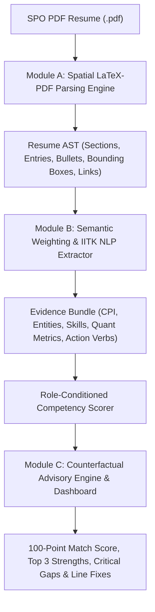

# The IITK Context-Aware Resume Diagnostic Engine 🎓

> **Academics and Career Council | Career Development Wing (CDW)**  
> **Anweshan '26 Problem Statement — 150 Points Edition**

[](https://www.python.org/)
[](https://fastapi.tiangolo.com/)
[](https://pymupdf.readthedocs.io/)
[](https://docs.pytest.org/)
[](https://iitk-resume.bittu.dev)

---

## 📌 Executive Overview & Problem Statement

Every placement season at IIT Kanpur, students invest immense effort into squeezing three years of rigorous academics, complex technical projects, and extracurricular leadership into dense, single-page Student Placement Office (SPO) LaTeX templates. Standard automated parsing tools often scramble multi-column layouts, miss campus-specific contexts (e.g. SURGE, CPI, PoRs), and provide generic advice.

The **IITK Context-Aware Resume Diagnostic Engine** is an intelligent, automated career advisor designed exclusively for candidate upliftment. The system takes an SPO-formatted PDF resume and target industry track, parses spatial text top-to-bottom and left-to-right, semantically evaluates achievements against role expectations, and generates hyper-specific, grounded counterfactual gap analysis.

---

## 📂 Comprehensive Repository File Structure

```text
IITK-Resume-Model/
├── main.py                          # CLI Interface & Server Entrypoint
├── pyproject.toml                   # Project Build Configuration & Package Metadata
├── requirements.txt                 # Production Dependencies Specification
├── README.md                        # Primary CDW PS Submission Documentation
├── DESIGN.md                        # UI/UX Design System Specification
├── PRODUCT.md                       # Product Requirement Document
├── docs/                            # Competition Submission Deliverables
│   ├── ATR.md                       # Architecture & Testing Report (Max 10 Pages)
│   ├── PRESENTATION_DECK.md         # Presentation Deck Pitch (Max 12 Slides)
│   └── references/                  # Official CDW Anweshan '26 Problem Statement PDFs
├── resume_engine/                   # Core Diagnostic Engine Package
│   ├── __init__.py                  # Package Initialization & Version Spec
│   ├── pipeline.py                  # End-to-End Orchestrator (ResumeEngine)
│   ├── parser/                      # Module A: Spatial LaTeX-PDF Parsing Engine
│   │   ├── pdf_parser.py            # PyMuPDF Spatial Block & Table Row-Stitching Engine
│   │   └── models.py                # Resume AST & Bounding Box Data Structures
│   ├── evidence/                    # Module B: Semantic Weighting & IITK NLP Extractor
│   │   ├── extractor.py             # Entity Recognition, CPI/JEE Extractor, Quant Impact & Verbs
│   │   └── models.py                # Evidence Bundle Data Models
│   ├── ontology/                    # Role Requirements & Placement Tracks
│   │   ├── roles.py                 # 6 Placement Tracks (SDE, Quant, Consulting, Core, Analyst, Product)
│   │   └── courses.py               # IIT Kanpur Course Catalog (4400+ Courses)
│   ├── scoring/                     # Role-Conditioned Competency Scorer
│   │   └── scorer.py                # Gradient Scoring, Outlier Bonuses & Penalties
│   ├── advisory/                    # Module C: Counterfactual Advisory Engine
│   │   └── advisor.py               # Counterfactual Gap Analysis & Line-by-Line Fixes
│   └── api/                         # Web Advisory Dashboard & REST Endpoints
│       ├── app.py                   # FastAPI Application & Endpoints (/analyze, /analyze-all, /health)
│       └── dashboard.py             # High-Density Command Center SPA (Tailwind + Chart.js)
├── scripts/                         # Benchmark & Validation Suite
│   ├── web_benchmark.py             # Live HTTP Load & Performance Benchmark Tool
│   ├── benchmark.py                 # Multi-Model CLI Evaluator
│   ├── audit_50_resumes.py          # 50 SPO Resume Batch Evaluator
│   └── generate_submission_pdf.py   # PDF Submission Report Generator
├── examples/                        # Sample Test PDF Resumes
│   └── resume2.pdf                  # Sample SPO Resume Fixture
└── tests/                           # Pytest Diagnostic Test Suite (45 Unit & E2E Tests)
    ├── test_stage1.py               # Module A Spatial Parser Unit Tests
    ├── test_stage6_e2e.py           # Module C REST API & End-to-End Tests
    ├── test_role_extensions.py      # Multi-Track Role Extension Unit Tests
    └── test_scrap_and_cpi_penalties.py # Academic Deficit & Scrap Penalty Tests
```

---

## 🏛️ System Architecture & Core Technical Modules



### Module A: The LaTeX-PDF Parsing Engine ([`resume_engine/parser/`](resume_engine/parser/))
- **PyMuPDF Extraction**: Extracts spatial text blocks, bounding boxes, and PDF annotation links without scrambling two-column LaTeX grids.
- **Horizontal Gap-Aware Table Stitching**: Uses `_stitch_table_rows(max_gap=30.0)` in [`pdf_parser.py`](resume_engine/parser/pdf_parser.py) to merge horizontally-aligned cells (such as education tables) while strictly preserving separation between independent left and right column sections.
- **Bullet & Link Normalization**: Detects bullet variants (`•`, `·`, `-`, `*`, `▪`) and classifies hyperlinks into `github`, `linkedin`, `codeforces`, `leetcode`, and `portfolio`.

### Module B: The Semantic Weighting & NLP Engine ([`resume_engine/evidence/`](resume_engine/evidence/))
- **IITK Jargon Recognition**: Dictionary and regex entity matching in [`extractor.py`](resume_engine/evidence/extractor.py) for campus bodies (`AnC Council`, `Gymkhana`, `SURGE`, `Techkriti`, `Antaragni`, `Programming Club`, `Takneek`).
- **Academic Metrics Extraction**: Parses CPI/CGPA, Class XII/X percentages, JEE Advanced AIR, KVPY, and Olympiad ranks.
- **Impact & Action Verb Evaluator**: Identifies weak action verbs (`worked on`, `assisted in`, `helped`) and verifies quantifiable impact metrics (e.g. `20% speedup`, `INR 75L+ grant`, `9500+ students`).

### Module C: The Advisory Dashboard & REST API ([`resume_engine/api/`](resume_engine/api/) & [`advisory/`](resume_engine/advisory/))
- **Single-Page Application**: Premium slate dark mode interface built with Tailwind CSS, FontAwesome, and Chart.js in [`dashboard.py`](resume_engine/api/dashboard.py).
- **Counterfactual Guidance**: Calculates potential score gain estimates (`+X.X pts`) in [`advisor.py`](resume_engine/advisory/advisor.py) for addressing critical gap areas.
- **Line-by-Line Formatting Fixes**: Pinpoints specific bullet IDs, page numbers, word count violations (>38 words), and domain-aware verb rewrite suggestions.

---

## 🎯 Role-Specific Evaluation Baselines

The engine dynamically conditions evaluation on 6 primary placement tracks defined in [`resume_engine/ontology/roles.py`](resume_engine/ontology/roles.py):

1. **Software Engineering (SDE)**: Prioritizes DSA coursework, competitive programming ratings (Codeforces/LeetCode), open source, and full-stack projects. Penalizes missing GitHub profile links (-6 pts).
2. **Quantitative Finance**: Heavily prioritizes exceptionally high CPI (8.5+ benchmark), rigorous mathematical coursework (Probability, Linear Algebra, Stochastic Calculus), and quantitative modeling. Penalizes low CPI (-5 pts).
3. **Management Consulting**: Requires high CPI (8.0+) or top-tier leadership spikes (Overall Coordinator, Head, Manager, Team 10+, Budget 5L+). Penalizes lack of consulting academic/leadership spike (-6 pts).
4. **Core Engineering**: Prioritizes SURGE research internships, core departmental electives, CAD/MATLAB proficiency (ANSYS, SolidWorks, CFD). Penalizes generic web-dev projects displacing core electives (-5 pts).
5. **Data Analyst**: Prioritizes SQL querying (joins/CTEs/window functions), statistical analysis, A/B testing, and dashboard reporting (Tableau/Power BI).
6. **Product Manager**: Prioritizes user research, customer discovery, problem framing, product analytics, and cross-functional shipping.

---

## 🚀 Quickstart & Usage

### 1. Installation
Clone the repository and set up a Python 3.10+ virtual environment:
```bash
git clone https://github.com/Bittu5134/IITK-Resume-Model.git
cd IITK-Resume-Model
python3 -m venv .venv
source .venv/bin/activate
pip install -e .
```

### 2. Run Automated Test Suite
```bash
pytest tests/ -v
```

### 3. CLI Resume Diagnosis
Analyze a PDF resume for a specific target track:
```bash
python main.py examples/resume2.pdf --role consulting
```

Save diagnostic JSON output to a file:
```bash
python main.py examples/resume2.pdf --role quant -o output.json
```

### 4. Run Local Web Advisory Server
Start local FastAPI server on port 8002:
```bash
python main.py --serve --port 8002
```

### 5. Live Production Deployment
- **Live Production URL**: [https://iitk-resume.bittu.dev](https://iitk-resume.bittu.dev)
- **Interactive Swagger API Docs**: [https://iitk-resume.bittu.dev/docs](https://iitk-resume.bittu.dev/docs)
- **Health Check Endpoint**: [https://iitk-resume.bittu.dev/health](https://iitk-resume.bittu.dev/health)
- **Deployment Specs**: Hetzner VPS container (`bittu@hackclub.app`) running systemd service with 4 Uvicorn worker processes on IPv6 port `8002` bound to `[::1]:8002`.
- **Automated CI/CD**: GitHub Actions workflow ([`.github/workflows/deploy.yml`](.github/workflows/deploy.yml)) triggered on `push` to `main`.

---

## 📊 Evaluation Scheme & Rubric Compliance

| Parameter | Weight | Implementation Highlights |
| :--- | :---: | :--- |
| **Diagnostic Accuracy** | 35% | Evaluates multi-track baselines, gradient competency scoring, and IITK jargon recognition. |
| **Codebase & Architecture** | 25% | Modular Python architecture ([`resume_engine/`](resume_engine/)), zero garbled text multi-column spatial parsing, 100% clean test suite. |
| **Actionability** | 25% | Pinpoints exact bullet snippets, provides domain-aware active verb suggestions, and calculates counterfactual score gains (`+X.X pts`). |
| **UI/UX & Usability** | 15% | High-density SPO Command Center SPA with dark theme, dynamic Chart.js radar plots, and instant role switching. |

---

## 📜 License & Credits
Developed for **Anweshan '26 — CDW Problem Statement** by IIT Kanpur Students.
